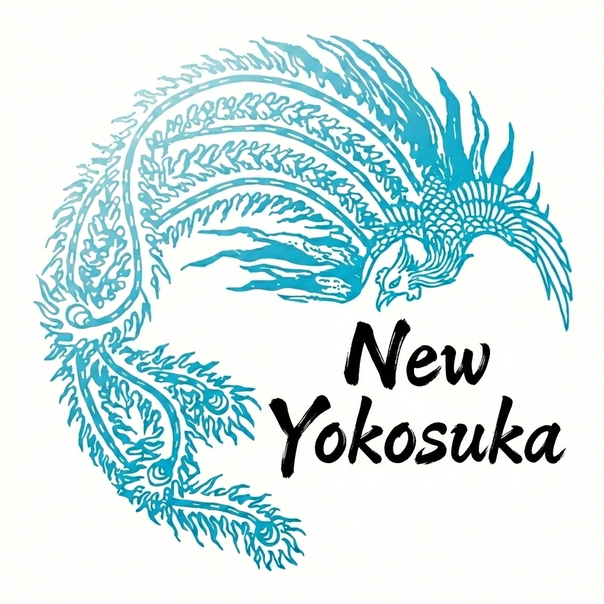
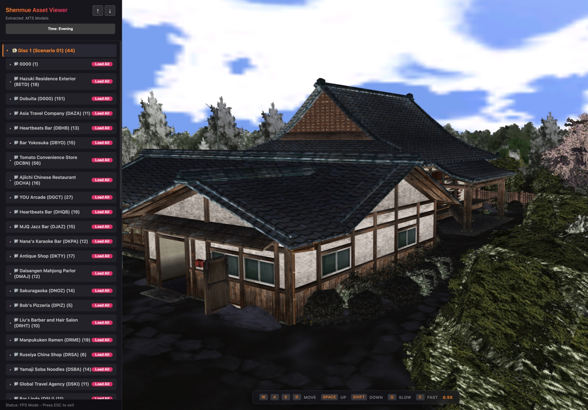

# New Yokosuka - A Shenmue 1 (Dreamcast) Asset Viewer

<p align="center">
  
  
</p>

<p align="center">
  <a href="https://www.youtube.com/watch?v=MbIwqwUXzaI" target="_blank">
    
    <br>
    <b>Video: New Yokosuka Demonstration</b>
  </a>
</p>

**Try it! [www.newyokosuka.com](https://www.newyokosuka.com/)**

Codenamed New Yokosuka, this is a proof-of-concept web-based model viewer for the original Dreamcast version of [Shenmue](https://en.wikipedia.org/wiki/Shenmue). My ambition for this project is to extract the harbor area of Shenmue 1 along with its forklifts models to recreate the daily forklift job from the original game. The model extraction is complete, but the re-implementation of assets into a new game engine will be a future phase of work.

It currently renders binary .MT5 models directly in your browser, utilizing custom parsers to process scenario and map data from across the game's multiple discs. The viewer imports model data into the Babylon.js engine, which allows for easy exporting into GLTF formats for use in other engines, modeling software, or 3D printing.

While the viewer successfully renders the vast majority of environmental models, it is currently missing several core engine features. The most prominent missing elements are proper character rendering and the automated placement of dynamic objects (decor, vehicles, doors, etc.) within maps. Additionally, some textures may show minor quality discrepancies or artifacts compared to the original Dreamcast source.

The most complex work-in-progress aspects include perfecting seamless time-of-day transitions and implementing prop distribution. Prop placement is a particularly difficult task because Shenmue often uses game scripts rather than static data tables to position objects. Achieving full scene population requires reverse-engineering these scripts to extract coordinates, a much more complex process than simple data parsing.

Much more in-depth information can be found in the [SHENMUE_DOCUMENTATION.md](SHENMUE_DOCUMENTATION.md) file.

## Features and Implementation

- **Native .MT5 Support**: Custom JavaScript parser for binary MT5 model files.
- **PVR Decoding**: Real-time decoding of PVR/PVRT texture data (including DXT compressed formats).
- **Time-of-Day System**: Cycle through Day, Sunset, Evening, and Night presets with appropriate texture pack swapping.
- **FPS Navigation**: True first-person controls with WASD movement and look-around.
- **Asset Streaming**: Optimized to stream assets from Cloudflare R2 for fast loading.
- **Skyboxes**: Dynamic sky domes that sync with the selected time of day - sort of. Separating assets that are unique to time of day is somewhat challenging.
- **Searchable Catalog**: Thousands of models organized by game scenario and zone.

## Research Tools and Extraction

In addition to the web-based viewer, this project includes the suite of Python-based utilities used for the original reverse-engineering and extraction process. These tools allow for:

- Disassembling SCN3 bytecode for script-based event analysis.
- Unpacking archives (.PKF, .PKS) and decoding PVR/PVRT textures.
- Generating the optimized binary packs and JSON catalogs for the web renderer.

Full documentation for these utilities can be found in the [**Research Tools README**](tools/README.md).

## Controls

When the renderer is active:

- **Click**: Capture mouse for First-Person view.
- **WASD**: Move forward, backward, and strafe.
- **Mouse**: Look around.
- **Space / C**: Fly Up / Fly Down.
- **Q / E**: Decrease / Increase movement speed.
- **ESC**: Release mouse.

## Known Issues and Limitations

- **Animations**: Currently supports static geometry only; bone/skin animations are not implemented.
- **Collision**: Physics and collision data are not utilized (no-clip exploration only).
- **Lighting**: Basic lighting simulation only; does not yet support original game light-field data.

## Setup: Extracting Game Assets

The web viewer streams assets from Cloudflare R2 by default, so **no extraction is needed just to view the site**. The extraction pipeline below is only needed if you want to process your own copy of the game data (e.g., to add new zones or update assets).

### Prerequisites

- **Python 3** with Pillow: `pip install Pillow`
- **Node.js** (for the web viewer and R2 upload)
- **Shenmue (Dreamcast) GDI disc images** — see below

### About the Discs

Shenmue (USA) shipped on **3 GD-ROM discs** plus a bonus Passport disc:
- **Disc 1**: Contains Scenario 1 zones (Dobuita, Hazuki Residence, Sakuragaoka, etc.)
- **Disc 2**: Contains additional Scenario 1 zones AND all Scenario 2 zones (Harbor, warehouses, etc.)
- **Disc 3**: The final game disc (additional Scenario 1/2 content)
- **Passport Disc**: Bonus content, not used by this project

This project currently uses **Disc 1 and Disc 2**. You need GD-ROM dumps in GDI format (a `.gdi` file plus several `.bin`/`.raw` track files per disc).

> **Note**: Game disc images are copyrighted material and are not distributed with this project. You must provide your own legally obtained copies.

### Directory Structure

Place your disc images in the `gamedata/` folder:

```
new-yokosuka/
├── gamedata/                          # Your disc images go here (gitignored)
│   ├── disc1/                         # Disc 1 GDI dump
│   │   ├── Shenmue (USA) (Disc 1).gdi
│   │   ├── Shenmue (USA) (Disc 1) (Track 1).bin
│   │   ├── Shenmue (USA) (Disc 1) (Track 2).bin
│   │   └── ...
│   └── disc2/                         # Disc 2 GDI dump
│       ├── Shenmue (USA) (Disc 2).gdi
│       ├── Shenmue (USA) (Disc 2) (Track 1).bin
│       └── ...
├── extracted_files/                   # Auto-created: Disc 1 extracted filesystem (gitignored)
├── extracted_disc2_v2/                # Auto-created: Disc 2 extracted filesystem (gitignored)
├── public/
│   ├── models/                        # Auto-created: processed model + texture files (gitignored)
│   ├── models.json                    # Auto-created: model catalog
│   └── textures/sky/                  # Sky dome PNGs (committed)
└── tools/                             # All extraction scripts
```

### Running the Full Pipeline

A single script handles the entire extraction process:

```bash
# Full pipeline: extract GDI → process models → convert sky textures
python3 tools/extract_all.py
```

This will:
1. **Extract** the GDI disc images into `extracted_files/` and `extracted_disc2_v2/`
2. **Process** all zones into `.MT5` model files and `.bin` texture packs in `public/models/`
3. **Generate** `public/models.json` (the catalog the web viewer reads)
4. **Convert** sky PVR textures to PNG in `public/textures/sky/`

Options:
```bash
python3 tools/extract_all.py --skip-extract    # Skip GDI extraction (if already done)
python3 tools/extract_all.py --extract-only    # Only extract GDI, don't process
```

### Running the Viewer

```bash
npm install          # First time only
npm run dev          # Start dev server at http://localhost:5173
```

By default the viewer streams assets from R2. To use your locally extracted files, set in `.env`:
```
VITE_OFFLINE_ASSETS=true
```

### Uploading to R2 (Production)

After extraction, push assets to Cloudflare R2 for CDN delivery:
```bash
node tools/upload_to_r2.js
```

### Running Individual Scripts

If you need to run specific steps manually, see [tools/README.md](tools/README.md) for the full list. Key scripts:

| Script | Purpose |
|--------|---------|
| `tools/extract_all.py` | Full pipeline (recommended) |
| `tools/gditools3.py -i <file.gdi> --extract-all` | Extract a single GDI disc image |
| `tools/sync_models.py` | Process extracted files into viewer format |
| `tools/convert_sky_textures.py` | Convert sky PVR textures to PNG |
| `tools/upload_to_r2.js` | Push assets to Cloudflare R2 |

## Research and Documentation

The custom parsers and technical implementations in this project were informed by existing reverse-engineering work documenting Shenmue's binary formats. For those interested in the underlying research, please see the [SHENMUE_DOCUMENTATION.md](SHENMUE_DOCUMENTATION.md) and the [**/tools**](tools/README.md) directory for bytecode analysis utilities.

## Reference Repositories

These external projects were used as references during development but are **not required**:

- **[Shenmue-Export-Tools](https://github.com/seiche/Shenmue-Export-Tools)**: Original PythonPVR decoder library (by seiche/Benjamin Collins).
- **[mt5_extraction_tools](https://github.com/yazgoo/mt5_extraction_tools)**: C++ PVR decoder (`ypvr`), useful as a reference implementation.
- **[ShenmueHDTools](https://github.com/derplayer/ShenmueHDTools)**: HD Remaster modding tools, useful for cross-referencing formats.

## Credits and Resources

Special thanks to the following resources:

- **Shenmue Export Tools**: Technical documentation and extraction hints from the [Shenmue-Export-Tools](https://github.com/seiche/Shenmue-Export-Tools) project.
- **Wulinshu Wiki**: The [Shenmue Format Documentation](https://wulinshu.com/wiki/index.php) served as a useful reference for some data structures.
- **Wudecon**: Research notes and format logic from the [LemonHaze420/wudecon](https://github.com/LemonHaze420/wudecon) project.
- **gditools3**: A [python library](https://github.com/AltoRetrato/gditools3) used to extract files, sorttxt.txt, and the bootsector (ip.bin) from SEGA Gigabyte Disc (GD-ROM) dumps.

And of course thanks to the original developers!

---

### Legal Disclaimer

Shenmue is a registered trademark of SEGA. This project is a non-commercial, fan-made tool intended for educational and research purposes only. It is not affiliated with, endorsed by, or sponsored by SEGA. All original game assets, models, and related content are the property of their respective trademark and copyright holders.

## License

This project is licensed under the [GNU General Public License v3.0](LICENSE).
