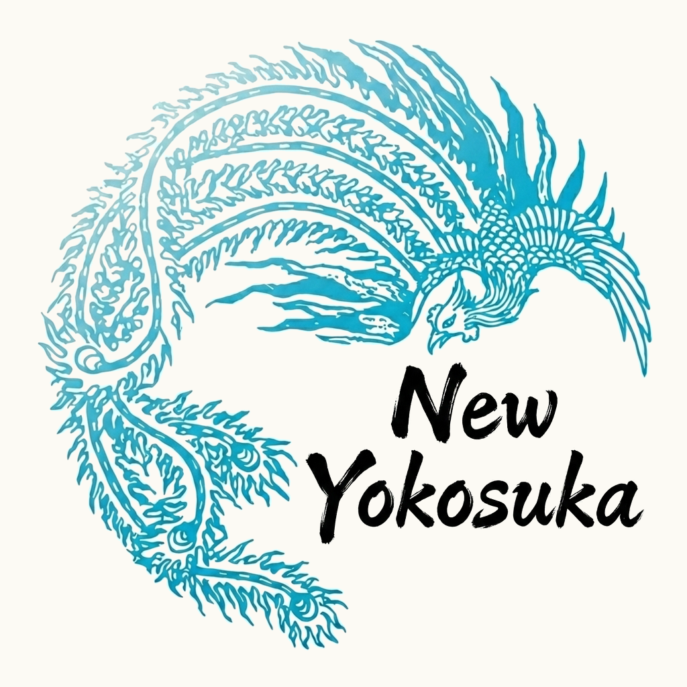
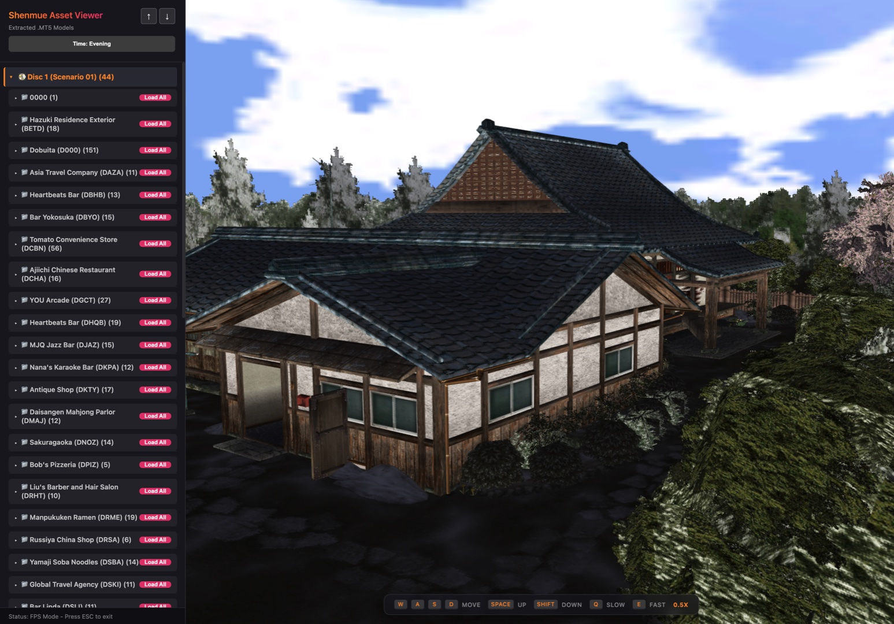

# New Yokosuka

<p align="center">
  
  
</p>

**Play the current build at [www.newyokosuka.com](https://www.newyokosuka.com/).**

New Yokosuka is a browser-based multiplayer recreation of the worlds of
**Shenmue I and Shenmue II**, with a searchable asset viewer and tools for
studying the original games.

Shenmue is a SEGA adventure game first released in Japan in **1999 for the
Dreamcast**. It follows Ryo Hazuki as he explores Yokosuka, meets its residents,
and investigates his father's murder.

The recreation is still in development, and story progression is not yet
available. You can explore locations from both games, talk to characters, drive and race forklifts, play arcade
games and nine-ball, and try other interactive activities together.

The client uses Babylon.js and a Go multiplayer server. It reads original
Dreamcast models, textures, animations, scene data, and dialogue to reconstruct
the worlds and their systems. Supported model, texture, and animation formats
are decoded at runtime, keeping preparation from original disc data to a
minimum. Some audio and gameplay metadata require separate extraction or
preparation steps.

The project is in development, with varying coverage across games and systems.
Research documents distinguish recovered original behavior from intentional
adaptations for the browser experience.

## Current capabilities

- Native Dreamcast MT5 and MT7 model loading and PVR/PVRT texture decoding.
- Time-of-day and seasonal presentation using original scene and texture data.
- MOTN-driven character animation, multiple playable characters, and
  first- and third-person controls.
- Terrain sampling and extracted native world collision.
- Runtime and statically recovered object placement, animation, and interaction.
- Native map transitions across the implemented worlds.
- Scheduled NPC routes and state simulated authoritatively by the Go server.
- Data-driven native dialogue selection, subtitles, available original voices,
  and persistent dialogue state.
- Playable martial-arts combat built from extracted motions and native evidence.
- Forklift driving, cargo handling, and races.
- Persistent guest and registered accounts, characters, progression, inventory,
  and shared-world multiplayer state backed by PostgreSQL.
- Original arcade cabinets through a self-hosted EmulatorJS
  runtime, plus native nine-ball in the MJQ Jazz Bar.
- A searchable asset viewer with model export through Babylon.js tooling.
- A browsable Shenmue I and II music and ambience archive with downloads.
- Reproducible extraction, emulator capture, static analysis, and evidence
  generation tools.

## Project status and boundaries

The project prioritizes source-backed behavior. Machine-readable evidence,
original file relationships, executable analysis, and captured Dreamcast
runtime state are preferred over filename guesses or visual approximation.

Important remaining boundaries include broader story and event execution,
camera and cutscene fidelity, unresolved native operation families, secondary
cloth motion, continuous weather and lighting behavior, and wider coverage of
game-state-dependent interactions. The general combat system has a proof of concept but is not very thoroughly implemented. Individual research documents describe the
evidence and limitations for each system.

Game disc images, arcade ROMs, and other copyrighted game data are not included.
You must provide your own legally obtained copies for local extraction or
research.

## Quick start

Install Node.js **22.19 or newer** and npm.

The browser uses hosted assets by default, so extracting game data is not
required for ordinary local development.
Extracted character, animation, sound, and music payloads are loaded from R2
using a checked-in checksum manifest. Project-created branding stays in Git.

```bash
npm install
npm run dev
```

Vite will print the local development URL, normally
`http://localhost:5173`. Open `/asset-viewer/` to browse assets or `/play/`
to enter the game. Multiplayer accounts and shared-world play require the
separate server below.

To start the browser and the separate Go multiplayer server together, clone
[`new-yokosuka-server`](https://github.com/brynnb/new-yokosuka-server) beside
this repository and run:

```bash
npm run dev:all
```

The launcher uses `../new-yokosuka-server` by default. Set
`NEW_YOKOSUKA_SERVER_DIR` if the checkout lives elsewhere. The server requires
Go and PostgreSQL; with PostgreSQL's command-line tools installed and no
`DATABASE_URL` configured, the launcher can create a repository-local
development database. The launcher also uses an installed .NET SDK to prepare
the Yarn script compiler when available. See the
[server README](https://github.com/brynnb/new-yokosuka-server#readme) for
explicit setup and configuration.

Useful validation commands:

```bash
npm test
npm run docs:check
npm run tools:check
npm run server:test
npm run build
```

`npm test` runs the JavaScript suite. Python and Playwright browser suites have
separate commands in the [test guide](tests/README.md). Server tests require
the sibling server checkout; some client tests require extracted data as
described below.

## Using locally extracted assets

The extraction pipeline is only needed when processing your own Dreamcast disc
images, adding or auditing zones, or reproducing the reverse-engineering work.
The Shenmue I Disc 1/2 extraction command is:

```bash
python3 -m tools.assets.extract_all
```

Read the [extraction guide](docs/guides/tooling/asset-extraction.md) before
running it: the model synchronization step rebuilds `public/models/`.
Use the separate [Shenmue I Disc 3](docs/guides/shenmue1-extraction.md) and
[Shenmue II](docs/guides/shenmue2-models.md) workflows for those discs.

To make the browser use the resulting local assets instead of the hosted asset
bucket, add this to `.env`:

```dotenv
VITE_OFFLINE_ASSETS=true
```

Extraction requirements, disc layout, individual utilities, Disc 3's isolated
staging workflow, and R2 upload tooling are documented in the
[research tools guide](tools/README.md). Extracted game files and intermediate
research captures are intentionally excluded from Git.

The full `npm test` suite includes JavaScript evidence checks and needs local
disc extracts, generated research captures and world models in addition to
runtime payloads. To restore the
published versions into ignored local files, run `npm run assets:restore`
before those tests. This verifies checksums and refuses to overwrite modified
files, but does not recreate the separate disc extracts or research captures.
Ordinary hosted development and production builds do not need this step.
For the asset-independent release checks on a fresh checkout, run:

```sh
node --test tests/MultiplayerClient.test.js tests/RemotePlayerManager.test.js tests/FrontendRelease.test.js tests/LuckyBreakPackage.test.js
npm run build
```

See [runtime asset publication](docs/guides/runtime-assets.md) for updating these assets.

## Repository guide

| Path | Purpose |
| --- | --- |
| `src/` | Shared browser renderer, asset viewer, loaders, and gameplay systems |
| `play/` | Playable-world runtime, UI, characters, dialogue, audio, and world data |
| `tools/` | Extraction, reverse-engineering, auditing, and evidence-generation tools |
| `tools/evidence/` | Source-control-safe machine-readable research evidence |
| `docs/` | Project architecture and feature guides |
| [tests/](tests/README.md) | Browser, gameplay, extractor, and evidence validation tests |
| `deploy/` | Frontend release and reverse-proxy configuration |

## Documentation

Start at the [documentation index](docs/README.md), organized into practical
guides, current implementation, original-game research, identifier references,
external sources, and design proposals.

- [Runtime assets](docs/guides/runtime-assets.md): restore and publish the data the client needs.
- [Tools](tools/README.md): extraction, analysis, and generation commands.
- [Deployment](DEPLOYMENT.md): the production release procedure.

## Arcade games and nine-ball

The Hang-On, Space Harrier, Astro Blaster, Pac-Man, and Space Invaders cabinets
use self-hosted EmulatorJS with bundled arcade cores. During `npm install`,
the preparation script downloads a pinned EmulatorJS release and its cores
from the upstream CDN, verifies their checksums, and caches them locally for
development and production builds. This step requires internet access.
Arcade ROMs are loaded separately and are excluded from the repository and
production builds.

The MJQ Jazz Bar pool table runs the renderer-neutral Lucky Break nine-ball
engine directly in the existing Babylon scene, using Shenmue's original table,
ball, and cue assets. See the [MJQ nine-ball guide](docs/implementation/mjq-pool.md) for
the ownership boundary, controls, and dependency update procedure.

## Reference projects and credits

New Yokosuka builds on research and tooling from the wider Shenmue community,
including:

- [Shenmue-Export-Tools](https://github.com/seiche/Shenmue-Export-Tools) for
  early extraction work and PythonPVR foundations.
- [mt5_extraction_tools](https://github.com/yazgoo/mt5_extraction_tools) for an
  independent MT5/PVR reference implementation.
- [ShenmueHDTools](https://github.com/derplayer/ShenmueHDTools) for HD Remaster
  format comparisons.
- [Wulinshu Shenmue format documentation](https://wulinshu.com/wiki/index.php).
- [Wudecon/ShenmueDKSharp](https://github.com/LemonHaze420/wudecon) for
  independent format and model-export findings.
- [gditools3](https://github.com/AltoRetrato/gditools3) for extracting Dreamcast
  GD-ROM filesystem data.

Thanks to the original Shenmue developers and to everyone who has documented,
preserved, and studied these games.

## Legal notice

Shenmue is a registered trademark of SEGA. New Yokosuka is a non-commercial,
fan-made project intended for education, preservation research, and technical
experimentation. It is not affiliated with, endorsed by, or sponsored by SEGA.
All original game assets and related content remain the property of their
respective owners.

## License

The project source is licensed under the [GNU General Public License v3.0](LICENSE).
